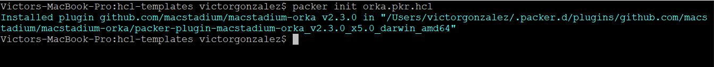
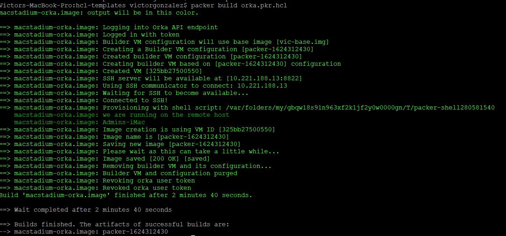

# General Usage
  
## Packer Template

In order to use the Orka packer plugin, you will have to define a packer template file.  The packer template file is the configuration
file that is used to define how to build an Orka image.  You can either use JSON or HCL to create the template. Because Packer recommends
using HCL, this document will only cover an HCL implementation. To learn more about JSON templates, please visit [here](https://www.packer.io/docs/templates/legacy_json_templates). 

For the first section, we will add the required plugins block.

```hcl
packer {
  required_plugins {
    macstadium-orka = {
      version = "= 3.0.0"
      source  = "github.com/macstadium/macstadium-orka"
    }
  }
}
```

As documented in the main [README](README.md), this is the section that is used with the `packer init` command.  It tells packer that it requires an additional plugin
to function. Underneath the `required_plugins` block is the name of the plugin to use which in turn creates a block that defines the version of the plugin
and the repository to pull it from.  `packer init` only works with orka plugin version 2.3.0 and up.

The next section we add are the variables.

```hcl
source "macstadium-orka" "image" {
  source_image    = "90gbsonomassh.img"
  image_name      = "sonoma-golden.img"
  image_description = "The golden image for Sonoma. Contains XCode N.M"
  orka_endpoint   = "http://10.221.188.20"
  orka_auth_token = "<AUTH_TOKEN>"
  ssh_username    = "<SSH_USERNAME>"
  ssh_password    = "<SSH_PASSWORD>"
}
```

The source definition specifies a plugin type to use (in this case “macstadium-orka”) and a label associated with the type ( image”).   This is saying that these variables will
be passed to the macstadium-orka plugin with the label image.   Adding plugin blocks with additional labels allows for parallel builds. The variables passed in here are recommended
for the orka packer plugin to function.  The only required variables are `source_image`,  `orka_auth_token`  and `orka_endpoint`.  For more information on these please view
the [Configuration Doc](./builders/config.mdx).

The build section specifies the type of build you want to perform and the type actions to take.

```hcl
build {
  sources = [
    "macstadium-orka.image"
  ]
   provisioner "shell" {
    inline = [
      "echo we are running on the remote host",
      "hostname",
      "touch .we-ran-packer-successfully"
    ]
  }
}
```

The sources array specifies the plugin source to use.  You can run different builds in parallel.  The provisioner block is what’s responsible for running commands in the created virtual machine.
Once an ssh connection is established, a commands in the inline array block will be executed.  In the case of the above snippet, an `echo` and `hostname` command will execute as well as creating
a file called .we-ran-packer-successfully.  Once this completes, the plugin will save a new image.

Putting it all together, you should have file looking like this.

```hcl
packer {
  required_plugins {
    macstadium-orka = {
      version = "~> 3.0"
      source  = "github.com/macstadium/macstadium-orka"
    }
  }
}
source "macstadium-orka" "image" {
  source_image    = "90gbsonomassh.img"
  image_name      = "sonoma-golden.img"
  image_description = "The golden image for Sonoma. Contains XCode N.M"
  orka_endpoint   = "http://10.221.188.20"
  orka_auth_token = "<AUTH_TOKEN>"
  ssh_username    = "<SSH_USERNAME>"
  ssh_password    = "<SSH_PASSWORD>"
}
build {
  sources = [
    "macstadium-orka.image"
  ]
   provisioner "shell" {
    inline = [
      "echo we are running on the remote host",
      "hostname",
      "touch .we-ran-packer-successfully"
    ]
  }
}
```

Save this as file named `orka.pkr.hcl`.  You can actually call this any name you want to but you have to make sure the file name has the suffix `.pkr.hcl` or else it will not work.

Ensure you are connected to your Orka cluster via [VPN](https://orkadocs.macstadium.com/v1.2.0/docs/vpn-connect) 

To initialize and download the plugin use this command:
`packer init orka.pkr.hcl`

If everything worked correctly, you should see output similar to this:


To build your image, enter:
`packer build orka.pkr.hcl`

This should kick off the build.  If everything worked correctly, you should have output similar to this.


If everything was successful, you should have a new image created with your changes saved.

For more information on using Packer plugins, please visit the [Packer Documentation](https://www.packer.io/docs/plugins).
For more information on using the Orka Packer plugin, please visit the [Configuration Documentation](./builders/config.mdx).
